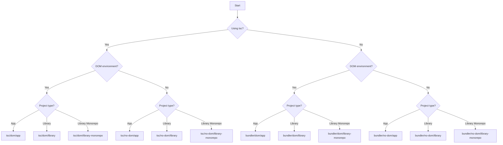

## Overview

`@zayne-labs/tsconfig` provides battle-tested TypeScript configuration presets for various project types. Inspired by [Matt Pocock's TSConfig Cheat Sheet](https://www.totaltypescript.com/tsconfig-cheat-sheet), these presets ensure proper compiler settings for your specific use case.

## Installation

<CodeGroup>
  ```bash pnpm
  pnpm add -D @zayne-labs/tsconfig
  ```

  ```bash npm
  npm install --save-dev @zayne-labs/tsconfig
  ```

  ```bash yarn
  yarn add -D @zayne-labs/tsconfig
  ```
</CodeGroup>

## Choosing the Right Config

The first step is determining which configuration preset fits your project. Answer these questions:

<Steps>
  <Step title="Are you using tsc to compile TypeScript?">
    If **yes**, choose from the `tsc` presets.
    
    If **no**, you're probably using a bundler (Vite, webpack, esbuild, etc.) - choose from the `bundler` presets.
  </Step>

  <Step title="Does your code run in the DOM?">
    If **yes**, choose a `dom` preset (includes browser APIs).
    
    If **no**, choose a `no-dom` preset (for Node.js, CLI tools, etc.).
  </Step>

  <Step title="What type of project are you building?">
    - **App**: Application or website
    - **Library**: Reusable package for npm
    - **Library (Monorepo)**: Library within a monorepo structure
  </Step>
</Steps>

## Using TypeScript Compiler (tsc)

If you're using `tsc` to turn your `.ts` files into `.js` files, use these presets:

<Tabs>
  <Tab title="DOM Environment">
    For code that runs in the browser:

    <CodeGroup>
      ```json App
      {
        "extends": "@zayne-labs/tsconfig/tsc/dom/app"
      }
      ```

      ```json Library
      {
        "extends": "@zayne-labs/tsconfig/tsc/dom/library"
      }
      ```

      ```json Library (Monorepo)
      {
        "extends": "@zayne-labs/tsconfig/tsc/dom/library-monorepo"
      }
      ```
    </CodeGroup>
  </Tab>

  <Tab title="Non-DOM Environment">
    For code that doesn't run in the browser (Node.js, CLI, etc.):

    <CodeGroup>
      ```json App
      {
        "extends": "@zayne-labs/tsconfig/tsc/no-dom/app"
      }
      ```

      ```json Library
      {
        "extends": "@zayne-labs/tsconfig/tsc/no-dom/library"
      }
      ```

      ```json Library (Monorepo)
      {
        "extends": "@zayne-labs/tsconfig/tsc/no-dom/library-monorepo"
      }
      ```
    </CodeGroup>
  </Tab>
</Tabs>

## Using a Bundler

If you're using an external bundler (Vite, webpack, esbuild, Rollup, etc.), use these presets:

<Tabs>
  <Tab title="DOM Environment">
    For code that runs in the browser:

    <CodeGroup>
      ```json App
      {
        "extends": "@zayne-labs/tsconfig/bundler/dom/app"
      }
      ```

      ```json Library
      {
        "extends": "@zayne-labs/tsconfig/bundler/dom/library"
      }
      ```

      ```json Library (Monorepo)
      {
        "extends": "@zayne-labs/tsconfig/bundler/dom/library-monorepo"
      }
      ```
    </CodeGroup>
  </Tab>

  <Tab title="Non-DOM Environment">
    For code that doesn't run in the browser (Node.js, CLI, etc.):

    <CodeGroup>
      ```json App
      {
        "extends": "@zayne-labs/tsconfig/bundler/no-dom/app"
      }
      ```

      ```json Library
      {
        "extends": "@zayne-labs/tsconfig/bundler/no-dom/library"
      }
      ```

      ```json Library (Monorepo)
      {
        "extends": "@zayne-labs/tsconfig/bundler/no-dom/library-monorepo"
      }
      ```
    </CodeGroup>
  </Tab>
</Tabs>

## Framework-Specific Configs

Some frameworks have specific TypeScript configuration requirements:

### Next.js

For Next.js projects:

```json tsconfig.json
{
  "extends": "@zayne-labs/tsconfig/bundler/dom/next"
}
```

<Note>
  More framework-specific configs will be added as needed.
</Note>

## Customizing Your Config

You can extend the base config with your own compiler options:

```json tsconfig.json
{
  "extends": "@zayne-labs/tsconfig/bundler/dom/app",
  "compilerOptions": {
    "baseUrl": ".",
    "paths": {
      "@/*": ["./src/*"]
    }
  },
  "include": ["src/**/*"],
  "exclude": ["node_modules", "dist"]
}
```

## Common Use Cases

<AccordionGroup>
  <Accordion title="React with Vite">
    ```json tsconfig.json
    {
      "extends": "@zayne-labs/tsconfig/bundler/dom/app",
      "compilerOptions": {
        "jsx": "react-jsx",
        "baseUrl": ".",
        "paths": {
          "@/*": ["./src/*"]
        }
      },
      "include": ["src"]
    }
    ```
  </Accordion>

  <Accordion title="Next.js App">
    ```json tsconfig.json
    {
      "extends": "@zayne-labs/tsconfig/bundler/dom/next",
      "compilerOptions": {
        "baseUrl": ".",
        "paths": {
          "@/*": ["./*"]
        }
      },
      "include": [
        "next-env.d.ts",
        "**/*.ts",
        "**/*.tsx",
        ".next/types/**/*.ts"
      ]
    }
    ```
  </Accordion>

  <Accordion title="Node.js CLI Tool">
    ```json tsconfig.json
    {
      "extends": "@zayne-labs/tsconfig/tsc/no-dom/app",
      "compilerOptions": {
        "outDir": "./dist",
        "rootDir": "./src"
      },
      "include": ["src/**/*"]
    }
    ```
  </Accordion>

  <Accordion title="Library with Declaration Files">
    ```json tsconfig.json
    {
      "extends": "@zayne-labs/tsconfig/bundler/dom/library",
      "compilerOptions": {
        "outDir": "./dist",
        "declarationDir": "./dist/types",
        "rootDir": "./src"
      },
      "include": ["src/**/*"]
    }
    ```
  </Accordion>

  <Accordion title="Monorepo Package">
    ```json tsconfig.json
    {
      "extends": "@zayne-labs/tsconfig/bundler/no-dom/library-monorepo",
      "compilerOptions": {
        "outDir": "./dist",
        "rootDir": "./src",
        "composite": true
      },
      "include": ["src/**/*"]
    }
    ```
  </Accordion>
</AccordionGroup>

## Multiple TSConfig Files

For complex projects, you might need multiple TypeScript configs:

<Tabs>
  <Tab title="App + Node Scripts">
    **tsconfig.json** (main app):
    ```json
    {
      "extends": "@zayne-labs/tsconfig/bundler/dom/app",
      "include": ["src"]
    }
    ```

    **tsconfig.node.json** (build scripts):
    ```json
    {
      "extends": "@zayne-labs/tsconfig/bundler/no-dom/app",
      "include": ["scripts", "vite.config.ts"]
    }
    ```
  </Tab>

  <Tab title="Frontend + Backend">
    **packages/frontend/tsconfig.json**:
    ```json
    {
      "extends": "@zayne-labs/tsconfig/bundler/dom/app",
      "include": ["src"]
    }
    ```

    **packages/backend/tsconfig.json**:
    ```json
    {
      "extends": "@zayne-labs/tsconfig/tsc/no-dom/app",
      "include": ["src"]
    }
    ```
  </Tab>
</Tabs>

## Decision Tree

Use this flowchart to quickly find the right preset:



## Best Practices

<Note>
  **Always extend a preset**: Don't start from scratch. The presets include carefully chosen defaults that work well together.
</Note>

<Warning>
  **Don't override strict settings**: The presets use strict compiler options for better type safety. Avoid loosening these unless absolutely necessary.
</Warning>

### Recommended Additional Settings

```json tsconfig.json
{
  "extends": "@zayne-labs/tsconfig/bundler/dom/app",
  "compilerOptions": {
    // Path aliases for cleaner imports
    "baseUrl": ".",
    "paths": {
      "@/*": ["./src/*"],
      "@components/*": ["./src/components/*"]
    }
  },
  // Include only your source files
  "include": ["src/**/*"],
  // Exclude build outputs and dependencies
  "exclude": ["node_modules", "dist", "build"]
}
```

## Troubleshooting

<AccordionGroup>
  <Accordion title="Module resolution errors">
    Make sure your `moduleResolution` is set correctly:

    ```json
    {
      "compilerOptions": {
        "moduleResolution": "bundler" // or "node" for Node.js
      }
    }
    ```
  </Accordion>

  <Accordion title="Cannot find type definitions">
    Install the necessary type packages:

    ```bash
    pnpm add -D @types/node @types/react # etc.
    ```
  </Accordion>

  <Accordion title="Path aliases not working">
    Ensure your bundler is configured to handle path aliases:

    **Vite:**
    ```ts vite.config.ts
    import { defineConfig } from 'vite'
    import path from 'path'

    export default defineConfig({
      resolve: {
        alias: {
          '@': path.resolve(__dirname, './src')
        }
      }
    })
    ```
  </Accordion>
</AccordionGroup>

## Next Steps

<CardGroup cols={2}>
  <Card title="ESLint Setup" icon="shield-check" href="/guides/eslint-setup">
    Configure ESLint with TypeScript support
  </Card>
  <Card title="Prettier Setup" icon="paintbrush" href="/guides/prettier-setup">
    Set up Prettier for consistent formatting
  </Card>
</CardGroup>
