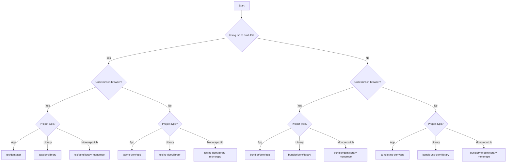

The `@zayne-labs/tsconfig` package provides proper TypeScript configuration presets for most project types. Choose the right config based on your build tool and runtime environment.

## Features

<CardGroup cols={2}>
  <Card title="Multiple Presets" icon="layer-group">
    Configs for apps, libraries, and monorepos
  </Card>
  <Card title="Environment Support" icon="globe">
    Separate configs for DOM and non-DOM environments
  </Card>
  <Card title="Build Tool Variants" icon="wrench">
    TSC and bundler-specific configurations
  </Card>
  <Card title="Framework Configs" icon="code">
    Special presets for Next.js and more
  </Card>
</CardGroup>

## Installation

```bash
pnpm add -D @zayne-labs/tsconfig
```

## Usage

1. Choose which `tsconfig.json` you need from the [list below](#list-of-tsconfigs)
2. Add it to your `tsconfig.json`:

```json title="tsconfig.json"
{
  "extends": "@zayne-labs/tsconfig/bundler/dom/app"
}
```

## List of TSConfigs

The key question: **Are you using `tsc` to turn your `.ts` files into `.js` files?**

<Tabs>
  <Tab title="Using TSC">
    If you're using TypeScript's `tsc` compiler to emit JavaScript files:

    ### DOM Environment
    
    For code that runs in the browser:

    ```json
    {
      // For an app
      "extends": "@zayne-labs/tsconfig/tsc/dom/app",
      
      // For a library
      "extends": "@zayne-labs/tsconfig/tsc/dom/library",
      
      // For a library in a monorepo
      "extends": "@zayne-labs/tsconfig/tsc/dom/library-monorepo"
    }
    ```

    ### Non-DOM Environment
    
    For code that runs in Node.js or other non-browser environments:

    ```json
    {
      // For an app
      "extends": "@zayne-labs/tsconfig/tsc/no-dom/app",
      
      // For a library
      "extends": "@zayne-labs/tsconfig/tsc/no-dom/library",
      
      // For a library in a monorepo
      "extends": "@zayne-labs/tsconfig/tsc/no-dom/library-monorepo"
    }
    ```
  </Tab>
  
  <Tab title="Using Bundler">
    If you're using an external bundler (Vite, Webpack, esbuild, etc.):

    ### DOM Environment
    
    For code that runs in the browser:

    ```json
    {
      // For an app
      "extends": "@zayne-labs/tsconfig/bundler/dom/app",
      
      // For a library
      "extends": "@zayne-labs/tsconfig/bundler/dom/library",
      
      // For a library in a monorepo
      "extends": "@zayne-labs/tsconfig/bundler/dom/library-monorepo"
    }
    ```

    ### Non-DOM Environment
    
    For code that runs in Node.js or other non-browser environments:

    ```json
    {
      // For an app
      "extends": "@zayne-labs/tsconfig/bundler/no-dom/app",
      
      // For a library
      "extends": "@zayne-labs/tsconfig/bundler/no-dom/library",
      
      // For a library in a monorepo
      "extends": "@zayne-labs/tsconfig/bundler/no-dom/library-monorepo"
    }
    ```
  </Tab>
</Tabs>

## Framework-Specific Configs

### Next.js

For Next.js applications:

```json title="tsconfig.json"
{
  "extends": "@zayne-labs/tsconfig/bundler/dom/next"
}
```

<Note>
  More framework-specific configurations will be added in future releases based on demand.
</Note>

## Config Types Explained

### App vs Library vs Library-Monorepo

<AccordionGroup>
  <Accordion title="App">
    Use for applications that are deployed and run, not published as packages.
    
    - Includes all necessary DOM types
    - Optimized for bundler output
    - Suitable for web apps, CLIs, servers
  </Accordion>
  
  <Accordion title="Library">
    Use for standalone libraries published to npm or other registries.
    
    - Configured for package distribution
    - Proper declaration file generation
    - Module resolution for consumers
  </Accordion>
  
  <Accordion title="Library-Monorepo">
    Use for libraries within a monorepo that are consumed by other packages in the same repo.
    
    - Optimized for workspace references
    - Faster builds with project references
    - Shared type checking across packages
  </Accordion>
</AccordionGroup>

### DOM vs Non-DOM

<Tabs>
  <Tab title="DOM">
    Use when your code runs in a browser environment:
    
    - Includes DOM type definitions
    - `document`, `window`, `HTMLElement`, etc.
    - Web APIs like `fetch`, `localStorage`
    
    **Examples:**
    - React applications
    - Vue applications
    - Browser extensions
    - Client-side libraries
  </Tab>
  
  <Tab title="Non-DOM">
    Use when your code runs outside the browser:
    
    - Excludes DOM type definitions
    - Node.js APIs
    - Server-side code
    
    **Examples:**
    - Express servers
    - CLI tools
    - Node.js libraries
    - Build scripts
  </Tab>
</Tabs>

### TSC vs Bundler

<Tabs>
  <Tab title="TSC">
    Use when TypeScript's `tsc` compiler is your build tool:
    
    - `module: "ESNext"` or `"CommonJS"`
    - Proper module resolution
    - Declaration file generation
    
    **When to use:**
    - Publishing libraries without a bundler
    - Node.js projects using `tsc` directly
    - When you need full TypeScript emit control
  </Tab>
  
  <Tab title="Bundler">
    Use when using external bundlers (Vite, Webpack, esbuild, etc.):
    
    - `module: "ESNext"`
    - `moduleResolution: "bundler"`
    - Optimized for bundler toolchains
    
    **When to use:**
    - Vite projects
    - Webpack projects
    - Any project where TypeScript is only for type-checking
  </Tab>
</Tabs>

## Customizing Configs

Extend the base config and override specific options:

```json title="tsconfig.json"
{
  "extends": "@zayne-labs/tsconfig/bundler/dom/app",
  "compilerOptions": {
    "baseUrl": ".",
    "paths": {
      "@/*": ["./src/*"],
      "@components/*": ["./src/components/*"]
    },
    "target": "ES2022"
  },
  "include": ["src"],
  "exclude": ["node_modules", "dist"]
}
```

## Common Customizations

### Path Aliases

```json title="tsconfig.json"
{
  "extends": "@zayne-labs/tsconfig/bundler/dom/app",
  "compilerOptions": {
    "baseUrl": ".",
    "paths": {
      "@/*": ["./src/*"],
      "@lib/*": ["./src/lib/*"],
      "@components/*": ["./src/components/*"]
    }
  }
}
```

### Strict Type-Checking

```json title="tsconfig.json"
{
  "extends": "@zayne-labs/tsconfig/bundler/dom/app",
  "compilerOptions": {
    "strict": true,
    "noUncheckedIndexedAccess": true,
    "noImplicitOverride": true
  }
}
```

### Monorepo with Project References

```json title="tsconfig.json"
{
  "extends": "@zayne-labs/tsconfig/bundler/dom/library-monorepo",
  "compilerOptions": {
    "composite": true,
    "declarationMap": true
  },
  "references": [
    { "path": "./packages/shared" },
    { "path": "./packages/utils" }
  ]
}
```

## Examples by Project Type

### React Application (Vite)

```json title="tsconfig.json"
{
  "extends": "@zayne-labs/tsconfig/bundler/dom/app",
  "compilerOptions": {
    "baseUrl": ".",
    "paths": {
      "@/*": ["./src/*"]
    },
    "jsx": "react-jsx"
  },
  "include": ["src"]
}
```

### Next.js Application

```json title="tsconfig.json"
{
  "extends": "@zayne-labs/tsconfig/bundler/dom/next",
  "compilerOptions": {
    "baseUrl": ".",
    "paths": {
      "@/*": ["./src/*"]
    }
  },
  "include": ["next-env.d.ts", "**/*.ts", "**/*.tsx", ".next/types/**/*.ts"],
  "exclude": ["node_modules"]
}
```

### Node.js CLI Tool

```json title="tsconfig.json"
{
  "extends": "@zayne-labs/tsconfig/tsc/no-dom/app",
  "compilerOptions": {
    "outDir": "./dist",
    "rootDir": "./src"
  },
  "include": ["src/**/*"]
}
```

### Published Library (with Bundler)

```json title="tsconfig.json"
{
  "extends": "@zayne-labs/tsconfig/bundler/dom/library",
  "compilerOptions": {
    "outDir": "./dist",
    "rootDir": "./src",
    "declaration": true,
    "declarationMap": true
  },
  "include": ["src/**/*"],
  "exclude": ["**/*.test.ts", "**/*.spec.ts"]
}
```

## Base Configuration

All presets extend a base configuration with sensible defaults. To use only the base:

```json title="tsconfig.json"
{
  "extends": "@zayne-labs/tsconfig/base"
}
```

<Warning>
  The base config is minimal and requires additional configuration. Use specific presets instead for production projects.
</Warning>

## Decision Tree

Use this flowchart to choose the right config:



## FAQ

<AccordionGroup>
  <Accordion title="Which config should I use for a React app with Vite?">
    Use `@zayne-labs/tsconfig/bundler/dom/app` since Vite is a bundler and React runs in the DOM.
  </Accordion>
  
  <Accordion title="What's the difference between library and library-monorepo?">
    `library-monorepo` is optimized for packages within a monorepo using project references, while `library` is for standalone packages.
  </Accordion>
  
  <Accordion title="Can I use multiple configs in one project?">
    Yes! Create separate `tsconfig.json` files for different parts of your project (e.g., `tsconfig.node.json` for build scripts).
  </Accordion>
  
  <Accordion title="Do I need to install TypeScript separately?">
    Yes, this package only provides configuration presets. Install TypeScript as a dev dependency: `pnpm add -D typescript`
  </Accordion>
</AccordionGroup>

## Credits

Inspired by [Matt Pocock's TSConfig Cheat Sheet](https://www.totaltypescript.com/tsconfig-cheat-sheet) from Total TypeScript.

## License

MIT © Ryan Zayne
